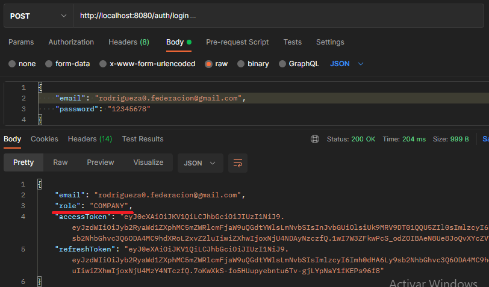
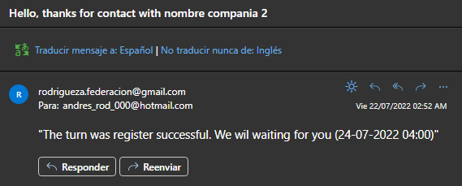

# Java - Spring Boot (Proyecto: API REST) REGISTRO DE TURNO PARA EMPRESAS 🚀

## Desarrollado por 🖥️  [AndresRodriguez](https://www.linkedin.com/in/andres-rodriguez-60a166208/) - [GitHub](https://github.com/AndrRod) - [PortFolio](https://andresporfolio.herokuapp.com/)

### Objetivo

Proyecto API REST - El objeto del presente proyecto es desarrollar a modo de prueba un sistema de turnos.
Donde el USUARIO EMPRESA pueda crear las empresas que desee, registrar turnos disponibles y los que están siendo reservados, poder realizar un CRUD solo sobre las empresas que son dueños o han creado, crear los turnos y los lugares disponibles.
El USUARIO CLIENTE tendra la posiblidad de seleccionar la empresa acorde al servicio que necesita, y de poder pedir una reserva, para lo cual podra realizarla dependiendo si se encuentra disponible en el día y horario señalado.
Las Reservas serán borradas de manera automatica pasado el día de la fecha de reserva, no se podran crear reservas con fecha anterior. Realizada la Reserva se envia un correo electronico al USUARIO CLIENTE.
 

### Herramientas utilizadas
- 👉 Java y Spring Boot
- 👉 Las rutas siguen el patrón REST
- 👉 Expresiones lambda y streams (programación funcional)
- 👉 Librería Spring Security - Configuración actualizada de seguridad
- 👉 Encriptación de contraseñas (PasswordEncoder)
- 👉 Utilización de tokens para validar rol de usuario a fin de que pueda utilizar determinados paths (access_token)  y refresh tokens para actualizar el periodo de vida del token (refresh_token).
- 👉 Manejo de Excepciones (Carpeta exception - excepciones particulares reutilizables - manejo general de excepciones)
- 👉 Manejo de Mensajes de respuestas (MessageSource, Clases reutilizables, properties exclusivos para mensajes, MessageSource)
- 👉 Paginación (Mediante una clase reutilizable llamada PaginationMessage).
- 👉 Utilización de DTOs (creación manual).
- 👉 Soft delete en determinadas entidades (borrado logico).
- 👉 Utilización de Postman, para comprobar comportamiento en cada path.
-----------------------------

FRONT END VISTA PREVIA 

---------------------------
FUNCIONALIDAD:

SISTEMA DE LOGIN EN BASE A JWT (Json Web Token): El usuario una vez logeado el programa emite o produce un token, el cual esta compuesto por los datos del usuario (role e email), lo cual puede verse en la imagen seguidamente. Estos datos son recogidos en la mayoria de los paths (en los controladores a traves de HttpServletRequest) a fin de ser usuados para realizar el correspondiente filtro. 

USUARIO SE REGISTRA:Por defecto todo usuario que se registra adquiere el rol de CLIENTE.  

USUARIO ROL EMPRESA: Para adquirir el role de empresario y crear la empresa, el Usuario ADMIN tiene asignarle dicho rol

ROLE EMPRESA: El usuario con Role Empresa, puede crear las empresas que quiera, puede realizar el CRUD correspondiente, pero solo en las empresas que haya creado:

Creación Empresa (POST EXITOSO):

Eliminación Empresa (DELETE ERROR, debido a que el usuario que intenta eliminar no es el Usuario Empresa que creo la Empresa)

Eliminación Empresa (DELETE EXITOSO): Eliminada la empresa, se eliminan junto con ella las entidades relacionadas como son: Turnos y Turnos No Disponibles.

Agregado de Turnos: Se crea el turno indicando la hora de comienzo y fin del mismo y los lugares disponibles en dicho turno;

RESERVAS: El Usuario Cliente y Empresa puede realizar las reservas en el dia y turno previsto, siempre y cuando estén disponibles. Las Reservas y turnos no disponibles son borrados de manera automatica una vez que pasa el día de la reserva.

Turno No disponible: Si el usuario intenta crear una reserva en el dia y horario que no se encuentra disponible el programa da un aviso.

A su vez se crea un objeto de la clase TurNotAvailable, el cual registra los turnos no disponibles.

Si se intenta crear un turno con fecha anterior al día de la fecha el programa emite un mensaje de error.

ENVIO EMAIL: Si se efectua el registro de una reserva de forma exitosa, la misma se informa con un email hacia el usuario indicando el día y la fecha de la reserva.

---------------------------------------------------
 

🎁 Hecho por  [AndresRodriguez](https://www.linkedin.com/in/andres-rodriguez-60a166208/) !!!!
